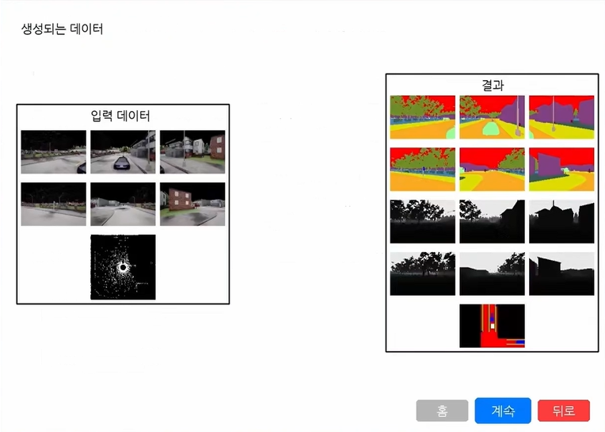
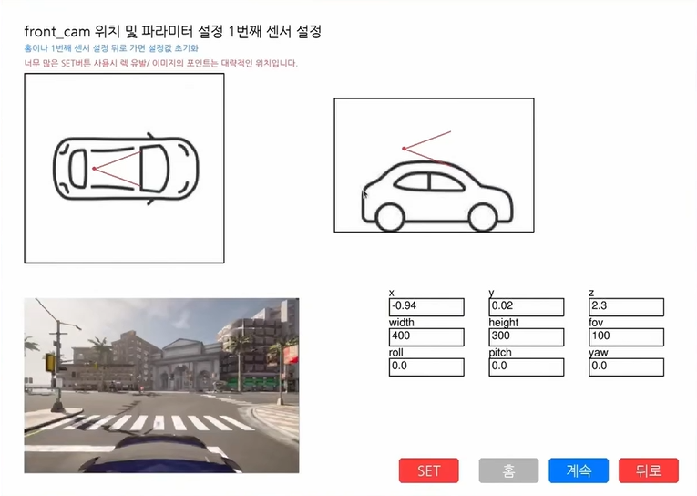
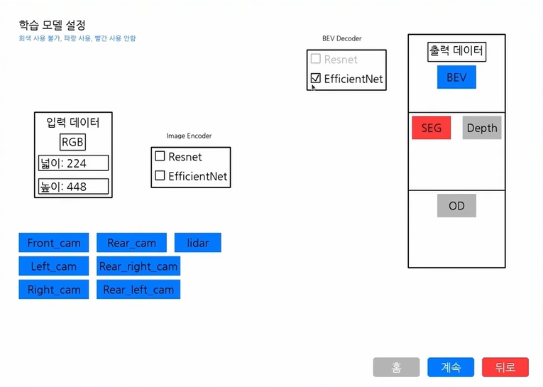
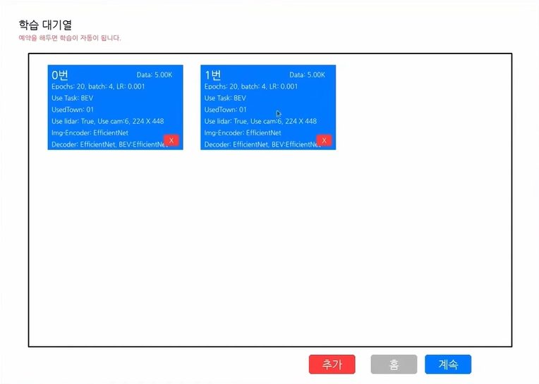
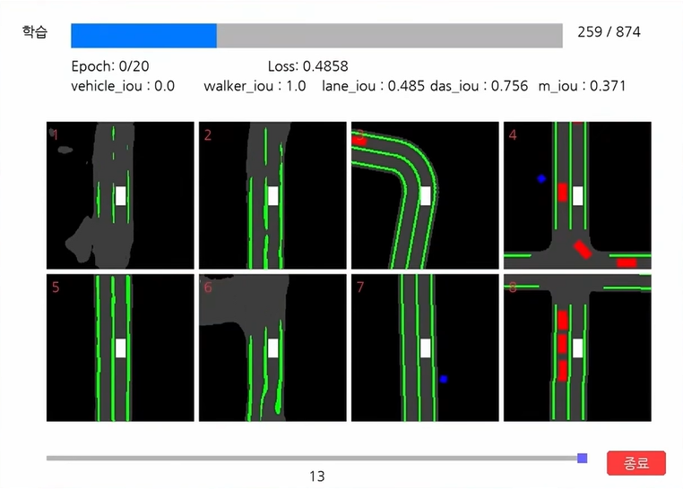

# SDV

[English](README.md)

KETI 재직 당시 수석 연구원의 제안으로 시작해 약 3개월간 단독 개발한 자율주행 연구 플랫폼의 초기 프로토타입입니다. 보유한 FMTC CARLA 맵을 연동해 센서 설정부터 데이터 생성, 모델 학습과 결과 확인까지 하나의 UI에서 수행하는 환경을 목표로 했습니다. 공식 연구 과제로 진행된 것은 아니며, 퇴사로 개발이 중단되어 일부 기능과 연동이 미완성 상태로 남아 있습니다.

SDV는 CARLA 센서 설정, 멀티모달 데이터 수집, 모델 구성, 학습, 결과 확인을 데스크톱 UI로 연결하는 초기 자율주행 연구 프로젝트입니다. 인지 모델 실험을 쉽게 구성하고 비교할 수 있는 연구 환경을 목표로 합니다.

> **초기 연구 프로토타입입니다.** 아직 해결되지 않은 오류와 미완성 연동이 많이 남아 있습니다. 코드를 수정하지 않으면 실행, 데이터 생성, 학습, 예측 표시가 실패할 수 있습니다. 이번 공개 버전의 전체 실행 과정은 검증하지 않았습니다.

**지원 언어:** 현재 프로그램 버전은 한국어만 지원합니다.

## 데모

- [SDV UI 시연](https://youtu.be/Y6UTaquOltg)
- [FMTC 지도: LiDAR 4대 융합 시연](https://youtu.be/UsxVp50MeAM)

영상과 이미지는 이전 시연 화면입니다. 현재 공개한 코드로 시연의 모든 기능을 재현할 수 있다는 의미는 아닙니다. 화면에 표시된 수치도 이번 버전에서 검증한 벤치마크 결과가 아닌 당시 실험 예시입니다.

## 처음 구상한 흐름

1. CARLA 타운, 카메라, LiDAR를 선택합니다.
2. 센서 위치·방향, 이미지 크기, 시야각을 설정합니다.
3. RGB, 세그멘테이션, 깊이, 객체 주석, BEV 데이터를 생성하고 확인합니다.
4. 모델 구성 요소와 학습 태스크를 선택하고 학습 파라미터를 설정합니다.
5. 실험을 대기열에 넣고 학습 진행·예측을 확인한 뒤, 저장된 결과를 비교하고 재학습합니다.

| 영역 | 현재 코드에 포함된 구성 요소 | 현재 한계 |
| --- | --- | --- |
| 데스크톱 UI | 센서 설정, 데이터 확인, 모델 선택, 학습 대기열, 결과 화면 | UI 동작과 백엔드 실행 경로가 완전히 연결되지 않음 |
| CARLA 데이터 생성 | 센서 래퍼, 내비게이션 도우미, 장면 생성, 멀티모달 출력 | 호환되는 CARLA 서버와 로컬 환경 필요 |
| 인지 모델 | EfficientNet/ResNet 인코더, BEV 투영, FPN/BiFPN, 선택적 PointPillar 특징, 태스크별 헤드 | 학습과 태스크 조합별 디버깅 필요 |
| 학습 실험 | `train2.py`, 객체 검출 실험용 `trainx2.py` | UI 학습 진입점 누락, 설정 경로 불일치, 하드코딩된 값 |
| 결과 확인 | 로컬 로그·지표 저장과 예측 표시 코드 | 호환되는 생성 결과와 저장 텐서 필요 |

### 센서 설정

### 모델·학습 설정

### 학습 과정 확인

## 추후 연구 계획

CARLA 실험 UI에서 출발해 시뮬레이션, 합성 데이터, 평가, 배포를 연결하는 연구 환경으로 확장하려는 계획입니다. 아래 항목은 연구 방향이며 이번 버전에서 전체 파이프라인을 구현한 것은 아닙니다.

| 방향 | 계획 |
| --- | --- |
| 경량 2D BEV 시뮬레이션 | 별도 프로젝트인 [LRS (Low Resource Simulation)](https://github.com/junwoomin/LRS)에서 개발을 진행하던 경량 BEV 시뮬레이터. Ackermann 운동학 모델을 활용해 낮은 시뮬레이션 비용으로 주행 행동과 장면 생성을 연구 |
| CARLA 검증 | LRS에서 생성한 장면 중 선택한 장면을 CARLA에서 검증하고, 장시간 CARLA 데이터 생성에 대한 의존도를 줄이면서 연구 환경의 활용성을 높이는 방향 탐색 |
| 스타일 변환·데이터 증강 | UniScene에서 영감을 받아 실제 데이터나 다른 시뮬레이션의 시각적 스타일을 반영하는 스타일 변환(style transfer)과 데이터 증강(data augmentation)을 접목하고, 다양한 환경에서 강건한 인지 모델을 학습할 수 있도록 확장하려던 구상 |
| BEV 조건부 생성 | BEV 장면을 조건으로 카메라 이미지·영상, 3D occupancy, LiDAR를 생성하고 장면 변이를 제어하는 방법 연구 |
| 데이터셋 평가 | CARLA·nuScenes에서 인지 성능을 비교하고 생성 데이터의 학습 효과 평가 |
| W&B 연동 | Weights & Biases로 실험 추적·분석, 하이퍼파라미터 탐색, 결과 저장·공유 |
| DEEPX·SDV-RUN | 호환 모델의 DEEPX 변환을 연구하고, 별도 실행 환경에서 예측·제어로 연결 |

생성 데이터의 사실성, 기하·시간 일관성, 실제 데이터로의 전이는 검증할 연구 과제입니다. 합성 데이터가 실제 데이터와 동등하거나 배포 경로가 이미 작동한다고 주장하지 않습니다.

이미지와 웹캠 입력으로 예측을 확인하는 인터페이스도 구상에 포함됩니다. 독립적인 예측 실행 흐름은 아직 완성되지 않았습니다.

[연구 계획과 제안 구조](docs/research-plan_ko.md)

## 코드 구성

| 경로 | 역할 |
| --- | --- |
| `start.py` | 데스크톱 UI와 실험 설정 |
| `carla_run.py` | CARLA 실행과 장면·센서 데이터 수집 |
| `carla_data_gan/` | 월드·센서·내비게이션·BEV 렌더링 도우미 |
| `train_model/` | 데이터 로더, 모델, voxel/pillar 처리, 손실 함수 |
| `train2.py`, `trainx2.py` | 실험용 학습 스크립트 |
| `utils.py` | 시각화·데이터·프로세스 도우미 |
| `sensor_config.yaml` | 센서·타운 설정 예시 |
| `img/` | 작은 UI 이미지와 센서 데이터 샘플 |
| `docs/` | 연구 계획, 개발 메모, 화면 이미지 |

## 실행 전 확인

[개발 메모](docs/development_ko.md)를 먼저 확인하세요. 기존 `requirements.txt`에는 누락된 의존성이 있고 UI의 자동 설치 버전과도 다릅니다. 동작하는 환경을 재구성하거나 실행 검증을 마친 버전이 아닙니다.

확인된 문제에는 UI가 호출하는 `train.py` 누락, UI·학습 스크립트의 설정 경로 불일치, CARLA 버전 불일치, 공개 대상에서 제외한 저장 테스트 텐서가 있습니다. Python 문법 검사는 통과했지만 import와 실제 실행을 검증한 것은 아닙니다.

캐시, 복사본, 현재 실행 경로와 연결되지 않은 구형 모듈, 노트북, 대용량 저장 테스트 텐서는 공개 대상에서 제외했습니다. UI가 사용하는 작은 이미지·데이터 샘플은 유지했습니다. 확인한 공개 대상 파일에서는 하드코딩된 API 키·토큰·비밀번호·개인 키를 발견하지 못했습니다.

## 라이선스

[MIT](LICENSE). 내비게이션 코드에 있는 CARLA 저작권·라이선스 표기를 유지합니다.
