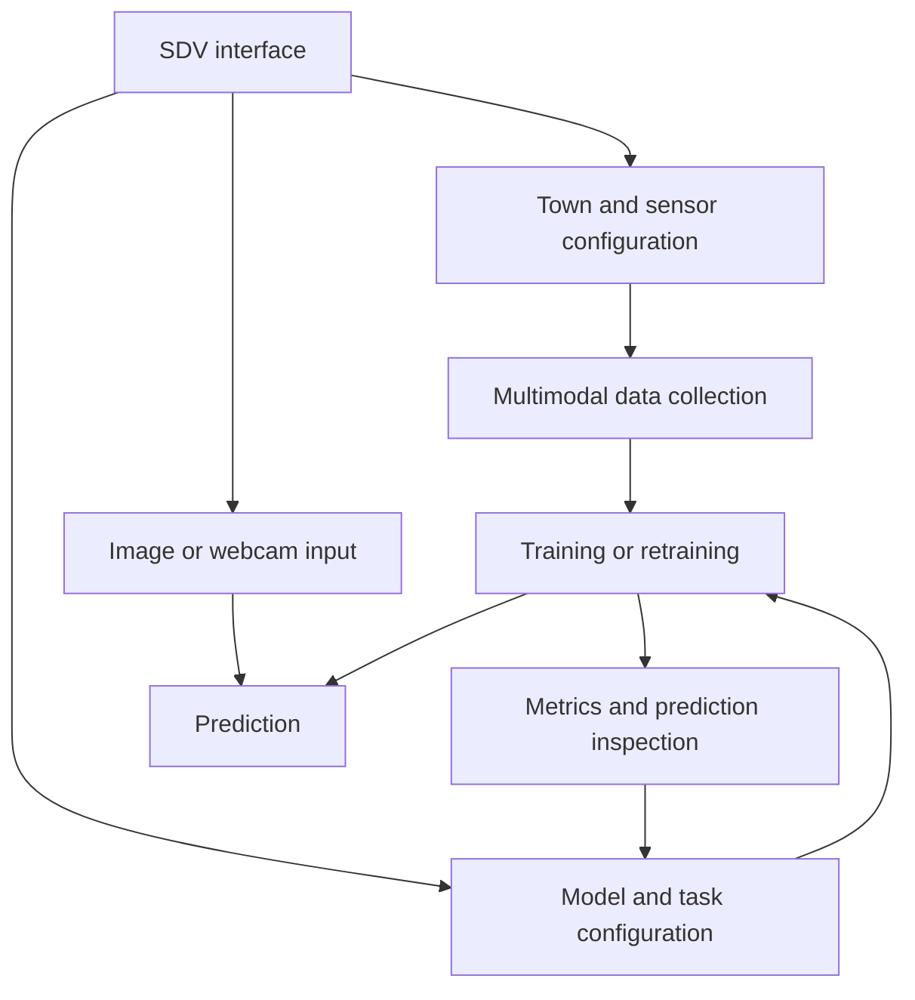
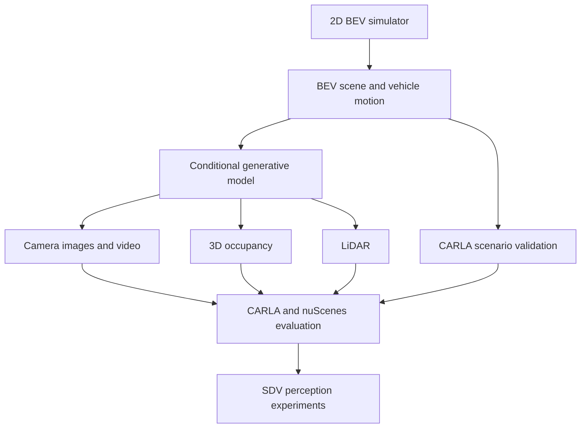

# SDV research plan

[한국어](research-plan_ko.md) · [Project overview](../README.md)

SDV starts from a graphical workflow for configuring sensors, generating data, choosing model components, and reviewing experiments. The longer-term goal is to make this workspace usable across simulation, perception research, and inference deployment.

## Initial design

The intended workflow branches into data collection, training, and prediction, with results feeding another experiment cycle.

The code contains parts of this design, including sensor controls, CARLA collection, model components, training scripts, and result screens. It does not yet provide a verified execution path through the entire graph. The image/webcam prediction branch also remains unfinished.

## Proposed simulation and generation path

Development of the lightweight 2D BEV simulator was being pursued in the separate [LRS (Low Resource Simulation)](https://github.com/junwoomin/LRS) project. The research direction is to generate controllable scenarios in LRS, then investigate how BEV scenes can condition richer sensor data. CARLA remains a validation environment.

This graph describes a proposal. The public source does not include a completed BEV simulator or the conditional generative pipeline.

### Vehicle simulation

The lightweight BEV vehicle simulation was being developed through LRS, with an Ackermann kinematic model as the intended approach. A first implementation should establish coordinates, steering limits, time steps, and reproducible trajectories before expanding to more complex traffic.

The motivation is to reduce the cost of scenario generation and reliance on long CARLA sessions. Lower memory use, faster generation, and adequate motion fidelity are hypotheses to measure.

### Sensor generation and evaluation

Investigate whether BEV scene structure can condition camera images/video, occupancy, and LiDAR while keeping the outputs mutually consistent. Scene variations should preserve the intended vehicle positions and road geometry.

Alongside reducing dependence on long-running CARLA data collection, the aim was to make the research workspace more useful. Inspired by UniScene, the intended extension was to incorporate style transfer and data augmentation reflecting real data or the visual styles of other simulators. The goal was to provide diverse training data for perception models robust across different environments.

The plan includes adapting suitable generation methods to CARLA scenes and comparing perception results with nuScenes. Literature examples that motivated this direction are not SDV implementation results.

Useful first experiments would measure whether adding generated samples improves held-out perception performance, whether camera/LiDAR geometry agrees with the BEV condition, and whether video preserves motion over time. These experiments have not been completed in this release.

## Experiment management and deployment

Weights & Biases is planned for experiment tracking, result analysis, automated hyperparameter search, and result storage/sharing. The current snapshot uses local experiment outputs and has no implemented W&B integration.

DEEPX export and SDV-RUN form the proposed deployment path. SDV would prepare a compatible model, and a separate runtime would handle prediction and eventually control. The UI's DEEPX option expresses this intention. It does not establish a functioning converter, device runtime, or validated control system.

## Suggested implementation order

1. Reconnect the existing UI, data collection, and training entry points and record a reproducible environment.
2. Verify one small end-to-end perception experiment with fixed configuration and dataset paths.
3. Add experiment tracking and consistent artifact metadata.
4. Connect the lightweight BEV vehicle simulation from LRS and validate selected trajectories in CARLA.
5. Test one BEV-conditioned output modality before attempting the full camera/occupancy/LiDAR pipeline.
6. Evaluate CARLA/nuScenes transfer and then investigate DEEPX deployment and SDV-RUN.

This ordering is a proposed next step, not a record of completed work.
