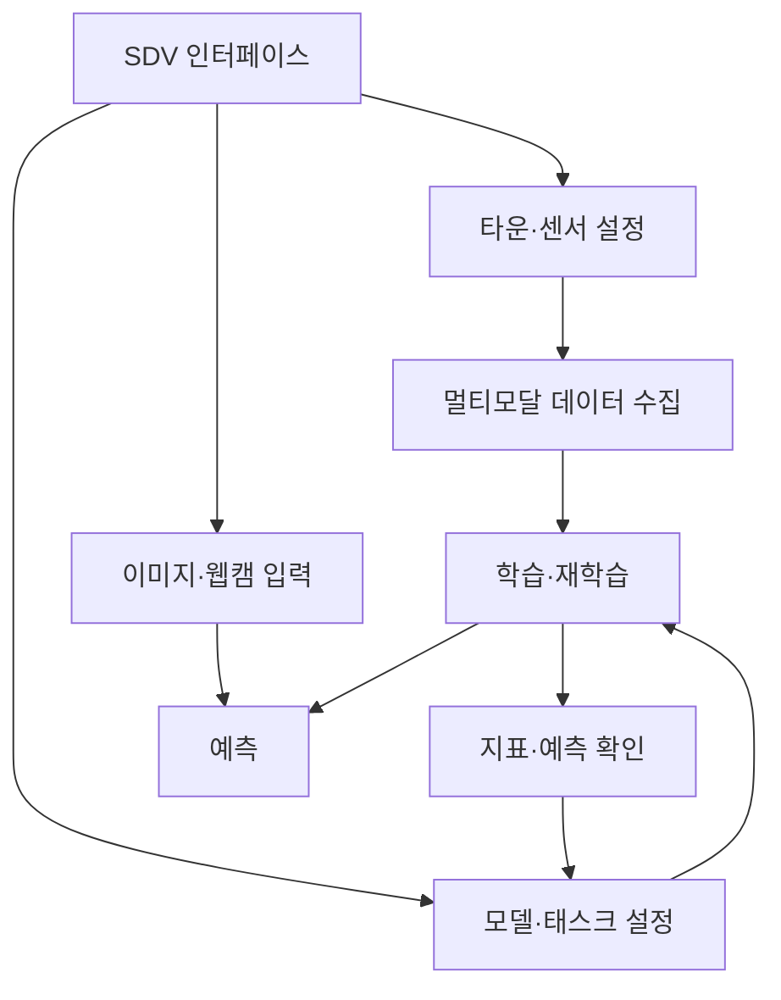
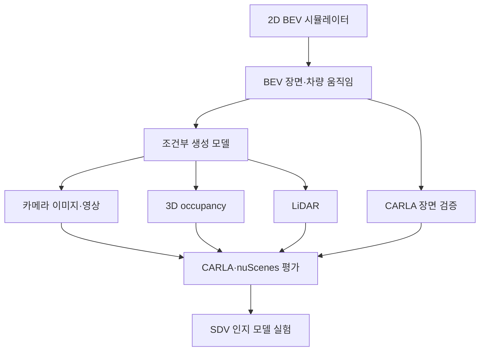

# SDV 연구 계획

[English](research-plan.md) · [프로젝트 소개](../README_ko.md)

SDV는 센서 설정, 데이터 생성, 모델 선택, 실험 결과 확인을 연결하는 그래픽 UI에서 출발했습니다. 장기적으로는 시뮬레이션·인지 연구·추론 배포에 함께 사용할 수 있는 연구 환경을 목표로 합니다.

## 초기 구상

데이터 수집, 학습, 예측으로 흐름을 나누고 결과를 다음 실험 설정에 반영하는 구조입니다.

센서 제어, CARLA 데이터 수집, 모델 구성 요소, 학습 스크립트, 결과 화면 일부가 코드에 포함되어 있습니다. 전체 구조를 연결한 실행 경로는 아직 검증하지 않았고 이미지·웹캠 예측 흐름도 미완성입니다.

## 시뮬레이션·생성 모델 확장

경량 2D BEV 시뮬레이터에서 제어 가능한 장면을 만들고, 이를 조건으로 더 풍부한 센서 데이터를 생성하는 방향입니다. CARLA는 선택한 장면을 검증하는 환경으로 활용하려는 계획입니다.

이 그림은 제안 구조입니다. 공개 코드에 완성된 BEV 시뮬레이터나 조건부 생성 파이프라인이 들어 있는 것은 아닙니다.

### 차량 시뮬레이션

Ackermann 운동학 모델로 BEV 안에서 차량을 움직이게 합니다. 첫 구현에서는 좌표계, 조향 범위, 시간 간격, 재현 가능한 궤적을 정리한 뒤 복잡한 교통 상황으로 확장하는 것이 적절합니다.

장면 생성 비용과 장시간 CARLA 실행에 대한 의존도를 줄이려는 목적입니다. 메모리 사용량 감소, 생성 속도 향상, 주행 움직임의 적절성은 측정할 가설입니다.

### 센서 생성과 평가

BEV 장면을 조건으로 카메라 이미지·영상, occupancy, LiDAR를 만들 때 출력 간의 일관성을 유지할 수 있는지 연구합니다. 장면을 변형하더라도 의도한 차량 위치와 도로 기하가 유지되어야 합니다.

적절한 생성 방법을 CARLA 장면에 적용하고 nuScenes와 인지 결과를 비교하는 계획이 포함됩니다. 이 방향의 동기가 된 문헌 예시는 SDV에서 구현하거나 측정한 결과가 아닙니다.

첫 실험에서는 생성 데이터 추가가 분리된 평가 데이터의 인지 성능에 도움이 되는지, 카메라·LiDAR 기하가 BEV 조건과 맞는지, 영상에서 시간에 따른 움직임이 유지되는지 확인할 수 있습니다. 이번 버전에서 완료한 실험은 아닙니다.

## 실험 관리와 배포

Weights & Biases로 실험 추적·결과 분석, 자동 하이퍼파라미터 탐색, 결과 저장·공유를 연결하려는 계획입니다. 현재 코드는 로컬 실험 결과를 사용하며 W&B 연동은 구현되어 있지 않습니다.

DEEPX 변환과 SDV-RUN은 배포 방향입니다. SDV에서 호환 모델을 준비하고, 별도 실행 환경에서 예측을 수행한 뒤 제어까지 연결하려는 구상입니다. UI의 DEEPX 선택 항목은 이 의도를 보여주지만 변환기·장치 런타임·검증된 제어 기능의 완성을 뜻하지 않습니다.

## 제안하는 진행 순서

1. 기존 UI·데이터 생성·학습 진입점을 연결하고 재현 가능한 환경을 기록합니다.
2. 설정과 데이터 경로를 고정한 작은 인지 실험을 처음부터 끝까지 검증합니다.
3. 실험 추적과 일관된 결과 메타데이터를 추가합니다.
4. 최소 BEV 차량 시뮬레이션을 만들고 일부 궤적을 CARLA에서 검증합니다.
5. 한 가지 BEV 조건부 출력부터 검증한 뒤 카메라·occupancy·LiDAR로 확장합니다.
6. CARLA·nuScenes 전이를 평가하고 DEEPX 배포와 SDV-RUN을 연구합니다.

위 순서는 다음 작업에 대한 제안이며 완료 기록이 아닙니다.
